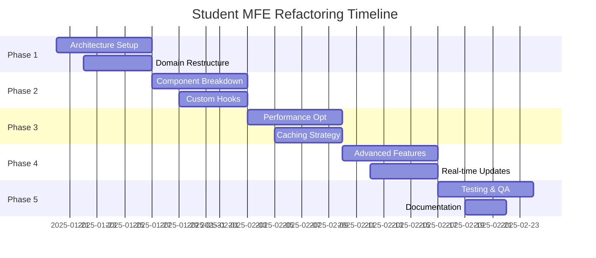

# 🏗 Student MFE Refactoring Plan

## 🎯 Objective
Transform Student MFE into a clean, scalable, and maintainable micro frontend following clean architecture and domain-driven design principles.

## 📋 Phase 1: Architecture Foundation ✅ COMPLETED

**Status: ✅ IMPLEMENTED (Components & Hooks)**

### ✅ Completed Implementation:

1. **Custom Hooks Created:**
   - `features/dashboard/useDashboard.ts` - Main business logic hook with state management
   - `features/dashboard/useQuizTabs.ts` - Tab navigation state and transitions  
   - `features/quiz-management/useQuizFilters.ts` - Quiz filtering and sorting logic

2. **Error Handling Components:**
   - `shared/ui/DashboardErrorBoundary.tsx` - Error boundary with retry functionality
   - `shared/ui/LoadingComponents.tsx` - Skeleton loading states

3. **Decomposed UI Components:**
   - `features/dashboard/ProfileHeader.tsx` - User profile display component
   - `features/dashboard/DashboardStats.tsx` - Statistics cards component
   - `features/quiz-management/QuizCard.tsx` - Individual quiz card component
   - `features/quiz-management/QuizList.tsx` - Quiz grid container component

4. **Refactored Main Component:**
   - `features/dashboard/StudentDashboardRefactored.tsx` - Clean architecture implementation

5. **Utility Functions:**
   - `shared/utils/dateUtils.ts` - Date formatting utilities
   - `shared/utils/quizUtils.ts` - Quiz-related helper functions

6. **Index Files:**
   - Feature-based exports for clean imports

### 📁 New Directory Structure (Implemented):
```
src/
├── app/                          # Application layer
│   ├── providers/               # Context providers
│   ├── router/                  # Route configuration
│   └── store/                   # App-level state
├── entities/                    # Domain entities (unchanged)
│   └── quiz/
├── features/                    # Feature modules
│   ├── quiz-management/
│   │   ├── api/               # Feature-specific API
│   │   ├── components/        # Feature components
│   │   ├── hooks/            # Custom hooks
│   │   ├── models/           # Business logic
│   │   └── types/            # Feature types
│   ├── dashboard/
│   └── profile/
├── shared/                      # Shared utilities
│   ├── api/                   # Generic API utilities
│   ├── ui/                    # Reusable UI components
│   ├── hooks/                 # Generic hooks
│   ├── utils/                 # Utility functions
│   └── constants/             # App constants
└── widgets/                     # Page-level widgets
    ├── QuizDashboard/
    ├── QuizList/
    └── ProfileWidget/
```

### 1.2 Clean Architecture Layers
- **Entities**: Business objects (Quiz, Student, Result)
- **Use Cases**: Business logic (StartQuiz, CompleteQuiz, GetQuizzes)
- **Interface Adapters**: Controllers, Presenters, Gateways
- **Frameworks**: React components, API clients, State management

### 1.3 SOLID Principles Implementation
- **Single Responsibility**: Each component has one reason to change
- **Open/Closed**: Extend behavior without modifying existing code
- **Liskov Substitution**: Interfaces over concrete implementations
- **Interface Segregation**: Small, focused interfaces
- **Dependency Inversion**: Depend on abstractions, not concretions

## 📋 Phase 2: Component Decomposition (Week 2-3)

### 2.1 Break Down Fat Components
```tsx
// Before: StudentDashboard (175 lines)
// After: Composed widgets

<StudentDashboard>
  <DashboardHeader />
  <QuizStatsWidget />
  <QuizTabsWidget>
    <AvailableQuizzesTab />
    <CompletedQuizzesTab />
  </QuizTabsWidget>
</StudentDashboard>
```

### 2.2 Custom Hooks for Business Logic
```tsx
// useQuizDashboard.ts
export const useQuizDashboard = () => {
  const { data, error, isLoading } = useQuizzes();
  const { startQuiz, completeQuiz } = useQuizActions();
  
  return {
    availableQuizzes: data?.available ?? [],
    completedQuizzes: data?.completed ?? [],
    actions: { startQuiz, completeQuiz },
    state: { isLoading, error }
  };
};
```

### 2.3 Error Boundaries & Fallbacks
```tsx
<ErrorBoundary fallback={<QuizDashboardError />}>
  <Suspense fallback={<QuizDashboardSkeleton />}>
    <QuizDashboard />
  </Suspense>
</ErrorBoundary>
```

## 📋 Phase 3: Performance Optimization (Week 3-4)

### 3.1 React Query Integration
```tsx
const useQuizzes = () => {
  return useQuery({
    queryKey: ['quizzes'],
    queryFn: quizService.getAll,
    staleTime: 5 * 60 * 1000, // 5 minutes
    cacheTime: 10 * 60 * 1000, // 10 minutes
  });
};
```

### 3.2 Virtualization for Large Lists
```tsx
import { FixedSizeList as List } from 'react-window';

const QuizVirtualList = ({ quizzes }: Props) => (
  <List
    height={600}
    itemCount={quizzes.length}
    itemSize={200}
    itemData={quizzes}
  >
    {QuizItem}
  </List>
);
```

### 3.3 Memoization Strategy
```tsx
const QuizCard = memo(({ quiz, onStart, onView }: Props) => {
  // Component implementation
});

const QuizList = () => {
  const handleStart = useCallback((quiz: Quiz) => {
    // Memoized handler
  }, []);
  
  const filteredQuizzes = useMemo(
    () => quizzes.filter(quiz => quiz.status === filter),
    [quizzes, filter]
  );
};
```

## 📋 Phase 4: Enhanced Features (Week 4-5)

### 4.1 Advanced Search & Filtering
```tsx
const useQuizFilters = () => {
  const [filters, setFilters] = useState({
    search: '',
    difficulty: null,
    subject: null,
    status: 'all'
  });
  
  const filteredQuizzes = useMemo(() => 
    applyFilters(quizzes, filters), [quizzes, filters]
  );
  
  return { filters, setFilters, filteredQuizzes };
};
```

### 4.2 Real-time Updates
```tsx
const useRealtimeQuizzes = () => {
  useEffect(() => {
    const socket = io('/quizzes');
    
    socket.on('quiz_updated', (quiz) => {
      queryClient.setQueryData(['quizzes'], (old) => 
        updateQuizInList(old, quiz)
      );
    });
    
    return () => socket.disconnect();
  }, []);
};
```

### 4.3 Micro-interactions
```tsx
const QuizCard = ({ quiz }: Props) => {
  const controls = useAnimation();
  
  const handleHover = () => {
    controls.start({ scale: 1.02, transition: { duration: 0.2 } });
  };
  
  return (
    <motion.div 
      animate={controls}
      onHoverStart={handleHover}
      className="quiz-card"
    >
      {/* Card content */}
    </motion.div>
  );
};
```

## 📋 Phase 5: Testing & Quality (Week 5-6)

### 5.1 Testing Strategy
```
├── __tests__/
│   ├── unit/           # Unit tests
│   ├── integration/    # Integration tests  
│   └── e2e/           # End-to-end tests
├── __mocks__/         # Test mocks
└── test-utils/        # Testing utilities
```

### 5.2 Quality Gates
- Unit test coverage > 90%
- Integration test coverage > 80%
- E2E critical path coverage > 95%
- Lighthouse performance score > 90
- Bundle size < 500KB

## 🎯 Success Metrics

### Performance
- First Contentful Paint < 1.5s
- Time to Interactive < 3s
- Bundle size reduction by 30%

### Developer Experience  
- Build time reduction by 50%
- Hot reload time < 2s
- Type safety coverage 100%

### User Experience
- Loading time perception improvement
- Interaction responsiveness
- Error recovery rate > 95%

## 🔄 Implementation Timeline



## 🚀 Next Steps

1. **Create feature branches** for each phase
2. **Set up CI/CD pipeline** with quality gates
3. **Implement monitoring** and analytics
4. **Plan gradual rollout** strategy
5. **Prepare rollback** mechanisms
